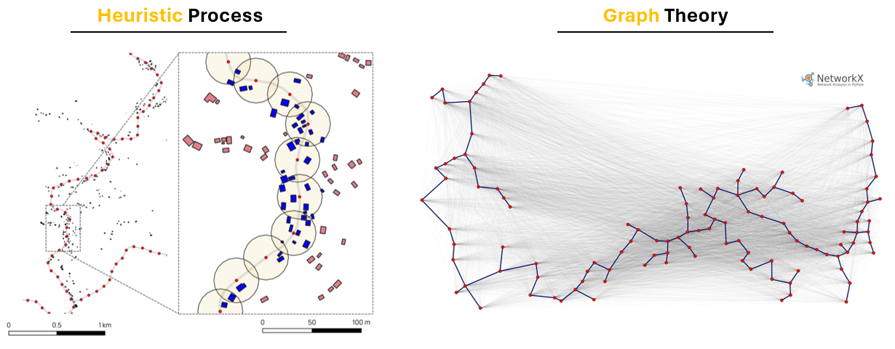
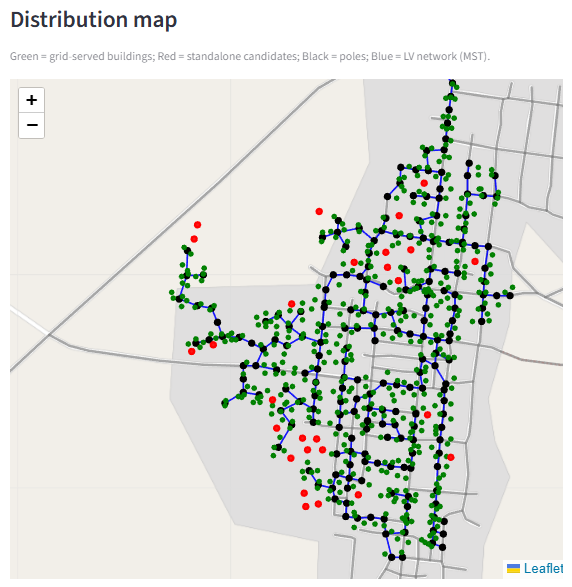

# **LV Distribution Network - Topology Assessment**

A lightweight, interactive **Streamlit application** for exploring **Low-Voltage (LV) distribution network topologies** starting from customer locations and optional road data.

The tool is designed as a **planning and assessment aid**, not as a detailed engineering design software. Its main purpose is to help users understand how **settlement geometry**, **connection heuristics**, and **simple engineering rules** affect pole count, LV network length, and costs.

## Overview

The application takes as input:
- A set of **building / customer connection points** (required)
- An optional **road network** (GeoPackage)

Using a combination of **heuristic pole placement** and **graph-based optimization**, the app constructs a **single connected LV network** and provides:
- An interactive map of poles, LV lines, and customers
- Summary metrics (length, cost, poles, served vs standalone)
- Downloadable GeoJSON outputs for further GIS analysis

## Conceptual Workflow

The tool follows a clear, staged logic:

### 1. Pole placement (heuristic)

Pole locations are generated using a geometric heuristic:

- **Road-based mode**  
  If a road network is provided, candidate poles are sampled along road geometries at a user-defined spacing.

- **Free-placement mode**  
  If no roads are provided, poles are placed inside the settlement by clustering nearby unserved buildings.

During this stage, buildings are associated to poles subject to:
- a maximum allowed **user–pole distance**
- a maximum number of **users per pole**

Additional poles are iteratively created to serve buildings that remain unassociated.


### 2. Optional selective coverage (standalone candidates)

The tool can optionally allow **very small or isolated clusters** of buildings to remain unserved by LV:

- Clusters below a user-defined **minimum cluster size** are not assigned a pole
- These buildings are flagged as **standalone system candidates**

This feature enables more realistic modeling of sparse settlements, where extending LV infrastructure may not be economically or technically justified.

### 3. LV network routing (Minimum Spanning Tree)

Once all poles are placed, the tool constructs the LV network by:

- Representing poles as nodes in a weighted graph  
- Assigning edge weights equal to Euclidean cable length  
- Computing a **Minimum Spanning Tree (MST)** using Kruskal’s algorithm (via NetworkX)

This guarantees:
- A **single connected radial network**
- No loops
- Minimum total LV conductor length for the given pole locations

<p align="center">
  
</p>

### 4. Engineering post-processing: pole-to-pole span control

To avoid unrealistically long LV spans, the tool applies an optional **post-processing step**:

- If any MST edge exceeds a user-defined **maximum pole-to-pole span**,  
  the edge is subdivided by inserting intermediate **support poles**
- This preserves:
  - a single connected network
  - total LV length
- While improving:
  - physical plausibility of individual spans
  - pole spacing realism

Importantly, this step **does not change routing decisions** — it only refines the network geometry.

## Key Parameters (User Controls)

The main parameters exposed in the interface are:

### Pole placement & association
- **Road pole spacing [m]**  
  Distance between candidate poles sampled along roads (road mode only)

- **Max user–pole connection radius [m]**  
  Maximum distance allowed between a building and the pole serving it

- **Max users per pole [#]**  
  Upper limit on how many buildings can be connected to the same pole

### Coverage behaviour
- **Allow isolated buildings to remain unserved**  
  Enables selective coverage

- **Minimum cluster size for LV [# buildings]**  
  Minimum number of nearby buildings required to justify LV extension

### Engineering refinement
- **Max LV span between poles [m]**  
  Maximum allowed pole-to-pole span; longer segments are subdivided with support poles

## Outputs

### Interactive map

The app displays an interactive map with clear visual encoding:

<p align="center">
  
</p>

### Summary metrics

Key indicators are reported, including:
- Total LV network length
- Total LV cost
- Number of buildings (total / grid-served / standalone)
- Number of poles

### Downloadable GIS outputs

The following GeoJSON files can be downloaded:
- **LV poles (nodes)**  
- **LV network (edges)**  

These outputs can be directly loaded into GIS software (QGIS, ArcGIS) or used in downstream analysis.

---

## Limitations and Scope

- Distances are Euclidean (not true cable routing along roads)
- Electrical constraints (voltage drop, losses, protection) are not modeled
- All poles are assumed equivalent (no transformer sizing differentiation)
- Cost model is simplified (linear with LV length)

Despite these simplifications, the tool provides **transparent, explainable, and reproducible** insights into LV network topology decisions.

---

# **Installation**

### **Conda (recommended)**

```bash
conda env create -f environment.yml
conda activate mgpy_distribution

```

### **Running**

```bash
streamlit run app.py
```

Then open:

```
http://localhost:8501
```

---

# **Contact**

**Alessandro Onori**  
📧 alessandro.onori@polimi.it  

Based on original work by **Edoardo Silvestri**

Technical Advisors  
- Riccardo Mereu — Politecnico di Milano  
- Emanuela Colombo — Politecnico di Milano

---

# **License**

European Union Public Licence (EUPL v1.1).
